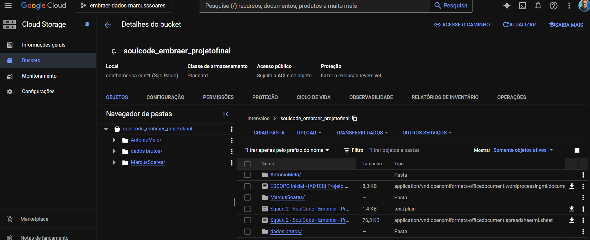
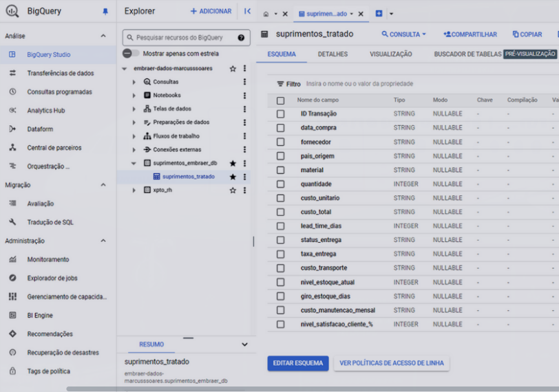
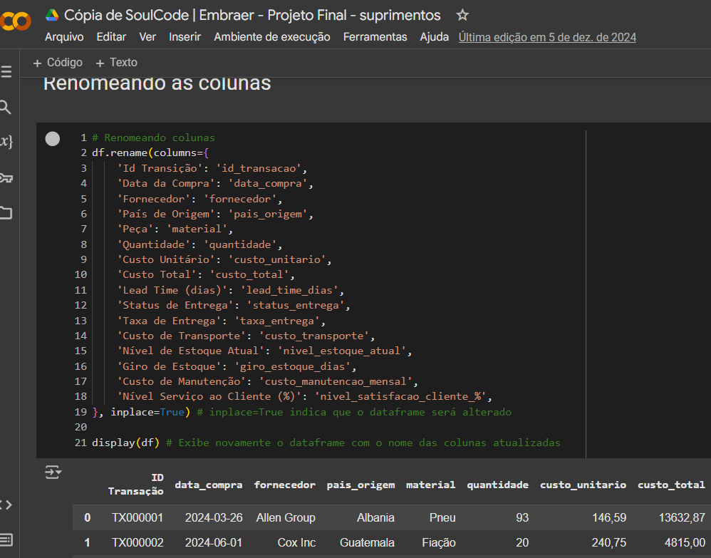
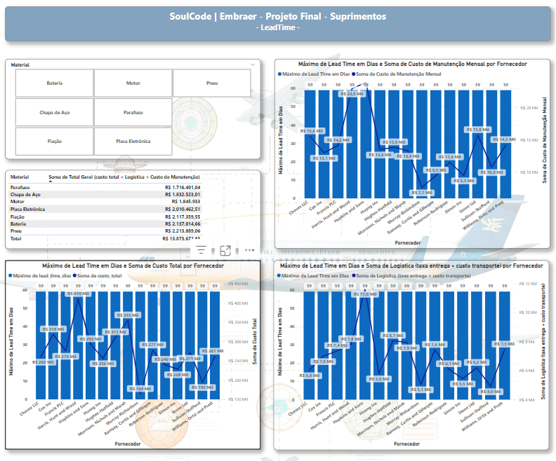
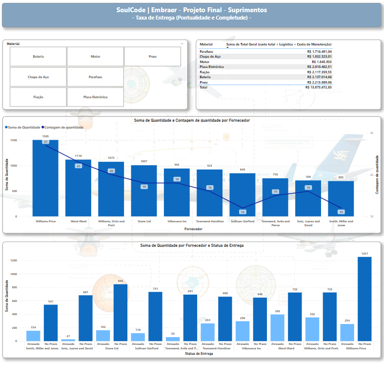
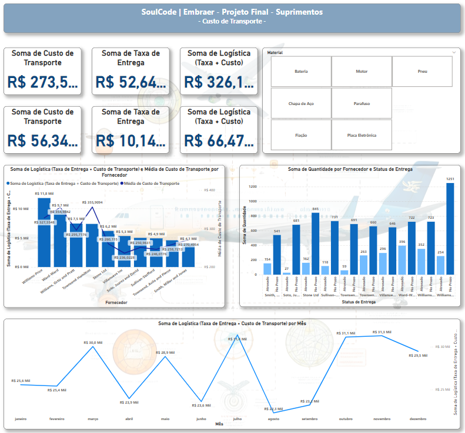
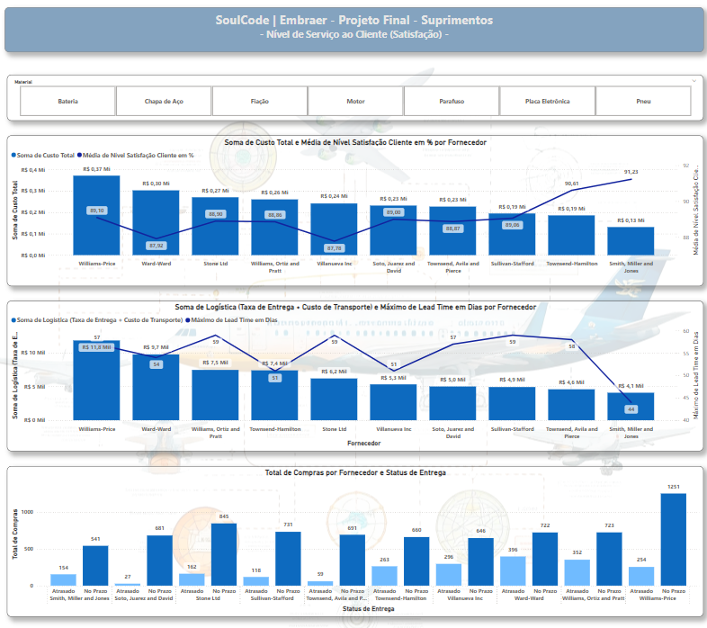

# embraer-projeto-analise-dados

Projeto apoiado pela Embraer de Análise de Dados utilizando
dados fictícios

Algumas premissas foram omitidas por motivos de
confidencialidade.

Ferramentas Empregadas: Google Cloud Platform (GCP): 
Para armazenamento seguro de informações com Google Storage e desenvolvimento de um
banco de dados relacional no BigQuery. IAM (Identity and Access Management):

Para definir permissões de acesso, assegurando segurança e conformidade com as
diretrizes da empresa. 

Google Colab (Python & Pandas): 
Para executar o
processo de ETL (Extração, Transformação e Carga) utilizando Python e Pandas,
realizando a limpeza e o processamento dos dados antes de transferi-los para o
BigQuery. Power BI: Para elaborar dashboards interativos e dinâmicos,
facilitando a visualização de informações e a geração de insights estratégicos.
Processo: Armazenamento de Dados: As informações foram transferidas para o
Google Cloud Storage para centralização e segurança.
Modelagem de Dados no Google BigQuery: Desenvolvemos
um banco de dados relacional no Google BigQuery, otimizado para armazenamento e
organização de dados.

Processamento ETL: 
Utilizamos o Google Colab,
combinando Python e Pandas, para transformar e limpar os dados antes de sua
carga no BigQuery.

Visualização: 
Construímos dashboards interativos no
Power BI, proporcionando acesso intuitivo e análise detalhada de grandes
volumes de dados.

Resultados: A solução implementada resultou em um
aumento significativo na eficiência do processamento e acesso aos dados, além
de ser escalável e segura. A governança de dados foi seguida rigorosamente, e
os dashboards dinâmicos facilitaram a análise.				

